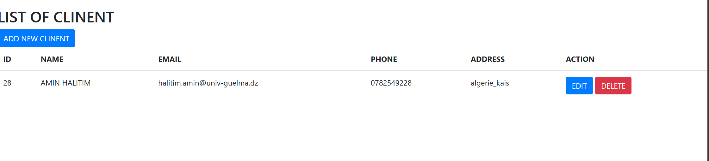
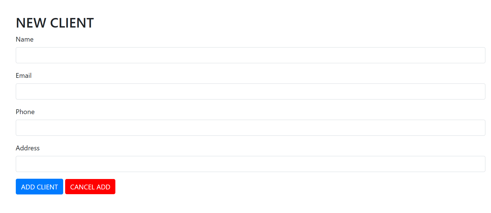
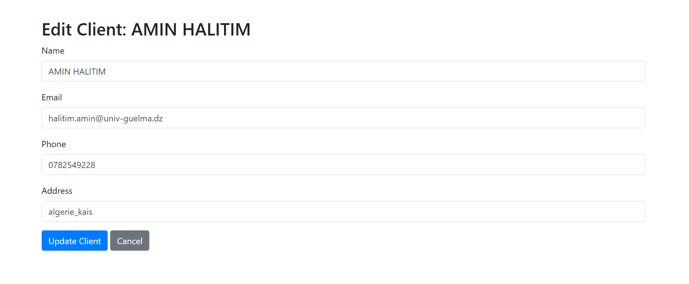

# Sales and Inventory Management System

This project is a web-based system for managing sales and inventory in a hypermarket.  
It is developed using **Java, PHP, MySQL, and Laravel**.

## Features
- Add new products to inventory.
- Edit existing product details.
- View all products in stock.
- Track sales and transactions.

## Screenshots

### Home Page


### Create Product Page


### Edit Product Page


## Technologies Used
- **Frontend**: HTML, CSS, JavaScript, Bootstrap  
- **Backend**: PHP (Laravel), Java  
- **Database**: MySQL  

## Setup Instructions
1. Clone the repository:  
   ```sh
   git clone https://github.com/yourusername/your-repository.git
